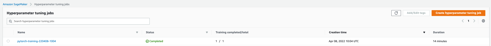
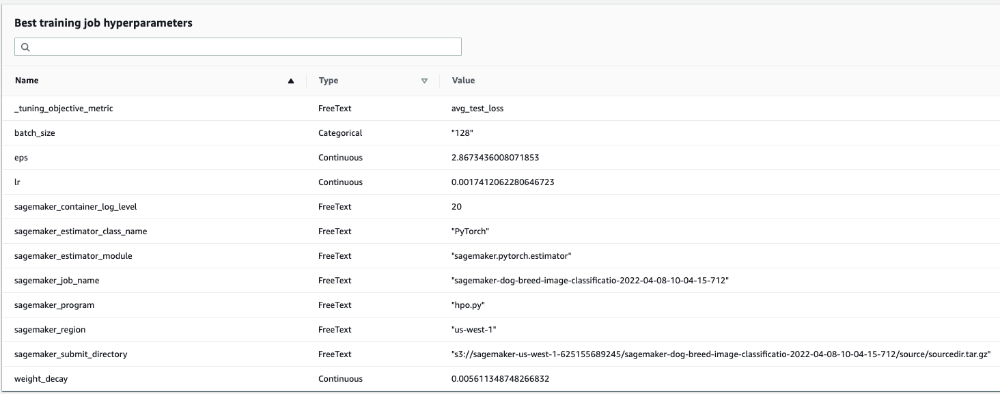
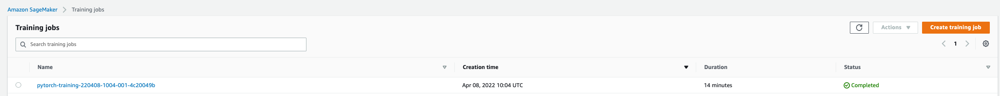

# Image Classification using AWS SageMaker

We use AWS Sagemaker to train a pretrained model that can perform image classification by using the Sagemaker profiling, debugger, hyperparameter tuning and other good ML engineering practices. This is done on the provided dog breed classication data set from udacity.

## Project Set Up and Installation
Enter AWS through the gateway in the course and open SageMaker Studio. 
Download the starter files.
Download/Make the dataset available. 

## Dataset
The provided dataset is Udacity's dogbreed classification dataset, which can be found in the classroom.
The project is designed to be dataset independent so you may replace this with other image classification datasets. 

### Access
Upload the data to an S3 bucket through the AWS Gateway or use the `train_and_deploy.ipynb` for this so that SageMaker has access to the data. 

## Files

- `hpo.py`: code used to do hyperparameter tuning jobs that train and test our image classifier models with different hyperparameters
- `train_model.py`: code that is used to run a training job that tests an image classifier with the best hyperparameters derived from tuning
- `train_and_deploy.ipynb`: notebook that triggers hyperparameter tuning, debugging, profiling, and testing of deployed image classifier

## Hyperparameter Tuning

This section lists what kind of model we choose to use for this experiment and why. 
Further, it gives an overview of the types of parameters and their ranges used for hyperparameter search. 
Note, we tune at least two hyperparameters as required. 
Finally, the README includes:
- Screenshot of completed training and hyperparameter tuning jobs 
- Log metrics during the training process (debugging and profiling)
- Best best hyperparameters from all our training jobs

We use a pretrained resnet50 model from Pytorch to avoid retraining an image classifier from scratch on our dog breed image data set. 

We use this particular model because it is a convolutional neural network, which works well on processing image data. The residual learning makes sure to skip layers in the network whose neurons are minimally active. We do finetuning (i.e., transfer learning) by adding a fully connected layer as the output on top of the pretrained residual network. During training, we freeze the pretrained model layers, and only finetune the final layer. The output is based on 133 neurons, which corresponds to the dog breeds. We use an adaptive optimizer called Adam that automatically adjusts the learning rate when minimizing the loss by following the gradient. 

We use the following hyperparameters:
- Learning rate: [0.000001, 1.0]
- Epsilon: [1, 3]
- Weight decay: [0, 0.1] 
- Batch size: 64, 128

These values are picked from experiments and rule of thumb tips. 

The `hpo.py` file is used for hyperparameter tuning and `train_model.py` for training jobs: 

 

## Debugging and Profiling

We now give an overview of how our model performed model debugging and profiling in sagemaker: 

During training and testing in the `.py` files, we add hooks to keep track of loss over time. In addition, we add rules in `train_and_deploy.ipynb` tracking issues like vanishing gradients, overfitting, poor weights etc. 

Plot showing the cross entropy loss during training and testing: 
**TODO**: screenshot of loss 

The loss is not smooth and very spiky
I suppose we could address it by trying out other batch sizes with shuffling our experimenting more with the network architecture. 

### Results

The profiler report can be found in the exported `profiler_report/profiler-output/profiler-report.html` file. 

The profiling/debugging helped me track if the training process was going well, and tracking is the loss went down correctly over time. 

**TODO**: profiler output and file link + html/pdf file submission 

## Model Deployment

The model was deployed to an 'ml.m5.xlarge' instance type and `train_and_deploy.ipynb` is used to deploy and test our predictor endpoint. For testing, I simply stored a few test images of dogs locally and fed those via the notebook to the inference endpoint. Instead of deploying the predictor directly, I could also have used boto3.  

**TODO**: Screenshot of the deployed active endpoint in Sagemaker.

