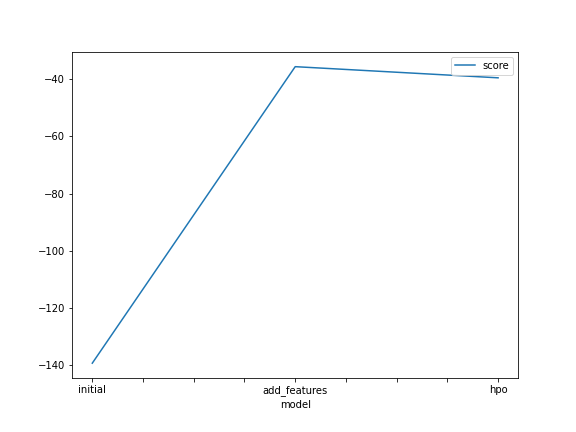
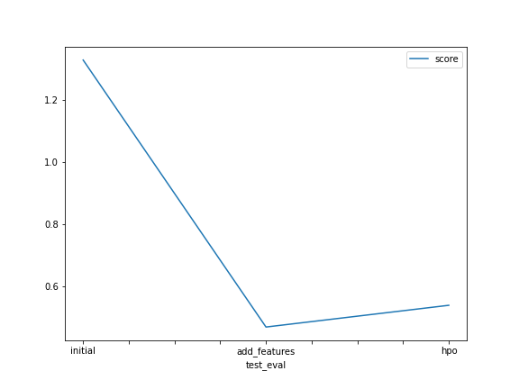

# Report: Predict Bike Sharing Demand with AutoGluon Solution
#### NAME HERE

## Initial Training
### What did you realize when you tried to submit your predictions? What changes were needed to the output of the predictor to submit your results?

I had to make sure that the predictor was used to predict the target label 'count' by feeding it the selected features only.

Also, I had to figure out that I needed to use the predict() method to get a series of predicted 'counts' back for all hourly bike sharing examples.

Finally, it seems that the submission datetimes map uniquely to the datetimes in the test data set, which is what we use to order our predictions by.

### What was the top ranked model that performed?

By default, AutoGluon tabular models use a mix of tree-based and neural network models. 

In our case, the top ranked model was a tree-based ensemble model trained with the default and new features without hyperparameter tuning. 

It got a root mean squared error of around 0,47 on the test set, which corresponds roughly to a top 1000 leaderboard score, where 0.34 is best.

## Exploratory data analysis and feature creation
### What did the exploratory analysis find and how did you add additional features?

The hourly dates in which bikes are rentes seems is approximately uniformly distributed (i.e., bikes are rentes equally much in 2011 and 2013).

Hourly bike rentals mostly don't happen during holidays, and often happen during working days. 

The temperature observed during hourly bike rentals is approximately normally distributed. 

The humidity observed during hourly bike rentals is left skewed (i.e., mostly high), and the windspeed is right skewed (i.e., mostly low).

The weather is right skewed and tuhs mostly tends to be clear weather (i.e., category 1). 

The count and registration of hourly bike rentals is right skewed, meaning the number of hourly bikes rented are usually below around 200. 

I figured that the year, month, day, and hour seem to matter in determining the total count of bikes rented per hour (as additional features). 

### How much better did your model preform after adding additional features and why do you think that is?

The baseline model obtained an rmse score of 1.33 and the model with new features obtained an rmse score of 0.47.

That corresponds to an improvement of 100 - 0.47 / 1.33 * 100 ~= 100 - 35 = 65%. 

## Hyper parameter tuning
### How much better did your model preform after trying different hyper parameters?

Surprisingly, the model with hyperparameter tuning performed worse than the model with new features, although it was better than the baseline. 

Perhaps, this is because I used the default hyperparameter configuration issued on the site: 

https://auto.gluon.ai/stable/tutorials/tabular_prediction/tabular-indepth.html#specifying-hyperparameters-and-tuning-them

For neural networks, it only changes the number of epochs, learning rate, activation function, layers, and dropout probability.

For tree ensembles, it only changes the number of boosting rounds, and number of leaves. 

Ideally, I should've tweaked these hyper parameters more to the task at hand in the pursuit of improvements. 

### If you were given more time with this dataset, where do you think you would spend more time?

I would spend more time doing feature engineering, and maybe investigate which features are the most descriptive. 

Namely, I would consider reducing the feature space by removing redundant features that are already described by other features.

Finally, I would consider if I could find other means of enriching the existing bike sharing data from external data sources. 

### Create a table with the models you ran, the hyperparameters modified, and the kaggle score.
|model|timelimit|presets|hp-method|score|
||--|--|--|--|
|initial|600|best quality|none|1.33|
|add_features|600|best quality|none|0.47|
|hpo|600|best quality|none|0.55|

### Create a line plot showing the top model score for the three (or more) training runs during the project.

### Create a line plot showing the top kaggle score for the three (or more) prediction submissions during the project.

## Summary

The biggest win came from doing exploratory data analysis and feature engineering. 

